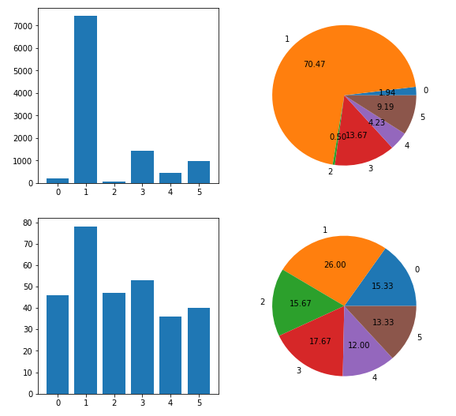
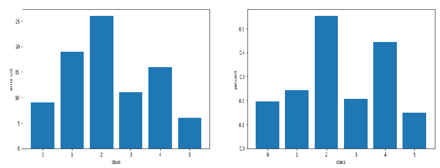
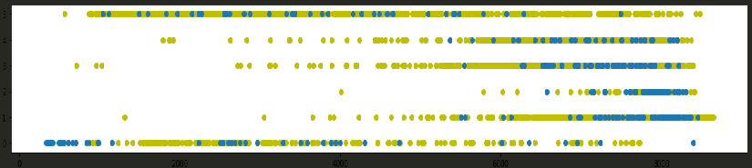

# 准备数据

```python
import pandas as pd

train_data = pd.read_csv('training.csv')
# 指出类别到数字的转换
labels = set(train_data['class'])
i = 0
label_to_digit = {}
for label in labels:
    label_to_digit[label] = i
    i += 1
print(label_to_digit)
# {'water': 0, 'forest': 1, 'orchard': 2, 'farm': 3, 'grass': 4, 'impervious': 5}

# 替换
for k,v in label_to_digit.items():
    train_data = train_data.replace(k,v)
train_data.head()

train_data.to_csv('train_data.csv')
d = pd.read_csv('train_data.csv')
d.head()

# 同样处理测试数据
# 不过要保证分类标号一样
test_data = pd.read_csv('testing.csv')
test_data.head()
# 替换
for k,v in label_to_digit.items():
    test_data = test_data.replace(k,v)
test_data.head()
test_data.to_csv('test_data.csv')
```

# 初始尝试训练
在数据未经任何处理的情况下看看可以达到什么效果,然后发现NB算法容错效果最好.
```python

```
可以看到,很多分类算法效果都不好,所以需要查查原因.
# 查看数据分布
经过分析,数据的分布是非常不均匀的,所以导致很多算法都预测出错,只管看看数据分布:

```python
import tensorflow as tf
import numpy as np
import matplotlib.pyplot as plt

TRAIN_DATA_FILE = "train_data.csv"
TEST_DATA_FILE = "test_data.csv"

training_set = tf.contrib.learn.datasets.base.load_csv_with_header(
    filename=TRAIN_DATA_FILE,
    target_dtype=np.int,
    features_dtype=np.float32,
    target_column=0
)
test_set = tf.contrib.learn.datasets.base.load_csv_with_header(
    filename=TEST_DATA_FILE,
    target_dtype=np.int,
    features_dtype=np.float32,
    target_column=0
)
# print(training_set)
X, y = training_set.data, training_set.target
print(X)
print(y)
X_test, y_test = test_set.data, test_set.target
print(X_test)
print(y_test)

train_count = []
test_count = []
xs = []
for i in range(6):
    xs.append(i)
    train_count.append(list(y).count(i))
    test_count.append(list(y_test).count(i))
print(train_count)
print(test_count)

# 画图
plt.figure(1, figsize=(9, 9))
plt.subplot(221)
plt.bar(xs, train_count)
plt.subplot(222)
plt.pie(train_count, autopct='%.2f', labels=xs)
plt.subplot(223)
plt.bar(xs, test_count)
plt.subplot(224)
plt.pie(test_count, autopct='%.2f', labels=xs)
plt.show()
```


# 如何处理样本不均衡问题?
常用的方法有以下几种:

1. 欠采样(Under-Sampling)
```
通过消除占多数的类的样本来平衡类分布；直到多数类和少数类的实例实现平衡.
但可能会丢失重要数据
```
2. 过采样(Over-Sampling)
```
通过复制少数类来增加其中的实例数量，从而可增加样本中少数类的代表性.
这种方法不会带来信息损失。表现优于欠采样.但可能过拟合.
```
3. 基于聚类的过采样（Cluster-Based Over Sampling）
```
在这种情况下，K-均值聚类算法独立地被用于少数和多数类实例。
这是为了识别数据集中的聚类。随后，每一个聚类都被过采样以至于相同类的所有聚类有着同样
的实例数量，且所有的类有着相同的大小.
这种聚类技术有助于克服类之间不平衡的挑战,但和过采样一样,可能过拟合.
```
4. 合成少数类过采样技术（SMOTE）

论文地址: [https://www.jair.org/media/953/live-953-2037-jair.pdf](https://www.jair.org/media/953/live-953-2037-jair.pdf)
```
synthetic minority over-sampling technique(SMOTE)
基本思想是:从少数类中把一个数据子集作为一个实例取走，接着创建相似的新合成的实例。
这些合成的实例接着被添加进原来的数据集。新数据集被用作样本以训练分类模型。
通过随机采样生成的合成样本而非实例的副本，可以缓解过拟合的问题。不会损失有价值信息。
但当生成合成性实例时，SMOTE 并不会把来自其他类的相邻实例考虑进来。
这导致了类重叠的增加，并会引入额外的噪音。
```
上面都是通过重采样来处理不平衡,结合本题,如果使用过采样,我们需要对另外5个类都增加数据.
这显然不太好.下面还有一些集成技术.

[http://scikit-learn.org/stable/modules/ensemble.html](http://scikit-learn.org/stable/modules/ensemble.html)

1. Bagging
```
生成多个个不同替换的引导训练样本，并分别训练每个自举算法上的算法，然后再聚合预测.
每个样本与原数据集有相同的分布,所以,只有当原分类器表现良好时才能使最后结果更好.
常用的: Bagging methods, Forests of randomized trees
```
2. Boosting
```
和Bagging相反,Boosting是将多个分类器串起来减少误差.
 AdaBoost, Gradient Tree Boosting
```
# 训练数据

## 1.使用Bagging

先按照顺序将1类数据分成4份,然后分别查看其精确度
```python
# 提取出类别为1的数据
X_1 = np.array([list(X[i]) for i in range(len(y)) if y[i] == 1])
y_1 = np.array([y[i] for i in range(len(y)) if y[i] == 1])
print(X_1.shape[0], y_1.shape[0])
# 提取出类别不为1的数据
X_n1 = np.array([list(X[i]) for i in range(len(y)) if y[i] != 1])
y_n1 = np.array([y[i] for i in range(len(y)) if y[i] != 1])
print(len(X_n1), len(y_n1))

al = int(len(X_1) / 4)
gnb = GaussianNB()
for i in range(4):
    xt1 = X_1[i * al:(i + 1) * al, :]
    yt1 = y_1[i * al:(i + 1) * al]
    X_temp = np.concatenate((xt1, X_n1), axis=0)
    y_temp = np.concatenate((yt1, y_n1), axis=0)
    # print(temp.shape)
    y_pred = gnb.fit(X_temp, y_temp).predict(X_test)
    
    # 记录每个结果,最后会评比
    
    acc = metrics.accuracy_score(y_test, y_pred)
    print(acc)

```
最后结果:可看出前面的数据更准确
```
0.71
0.7
0.62
0.586666666667
```
现在将1类数据打乱,再执行上述过程:


准确度依然保持70%左右,所以来看看到底是哪些预测错了:

下图展示了每种类别预测错误的个数,右边是百分比,经过多次实验,趋势基本相同



可以看到,类别2超过50%都错了.

# 数据可视化
蓝色是测试数据,黄色是训练数据,y轴是类别,x轴是max值



